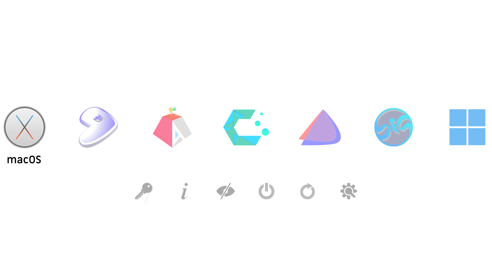
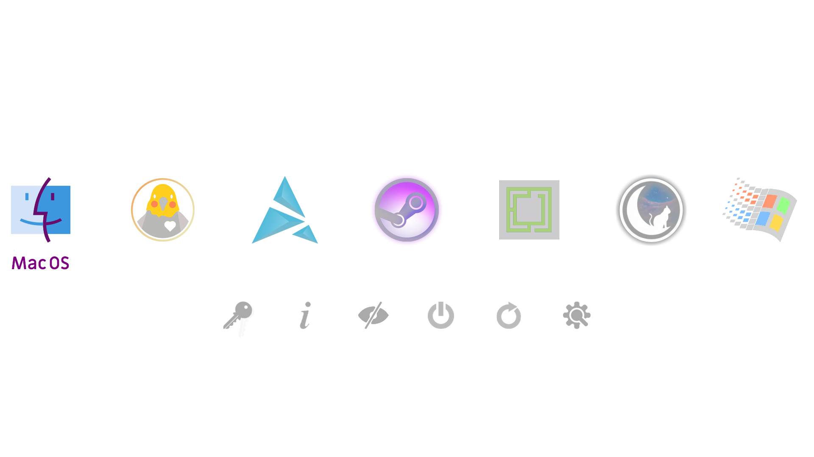

# rEFInd Tricky Transparencies Light Theme

This rEFInd boot manager theme uses transparency to vibrantly highlight and reveal a text label for only the selected icon.

rEFInd uses a background image to highlight the active icon typically with an outline, underline, halo, etc. The icons of this theme are all custom edited so that they morph when their background changes from white to black. Each icon contains a transparent text label, and it is easy to change the color of these labels or to hide them.

Swapping icons to or from this theme will not work without modification. In part for that reason the selection of included icons is extensive (every rEFInd function & tool, over 100 distros, alternate retro icons for Mac & Windows). Monochrome icons are also included for popular distros to use with refind-btfrs snapshots.

### Icons Demo (50% Scale):

### Dark Version: [refindTTT](https://github.com/gutlessCGH/refindTTT)

### Installation

Copy the theme folder to a `themes` directory inside the refind EFI directory (usually `/boot/EFI/refind`)

**Example**
>                                               
	sudo mkdir /boot/EFI/refind/themes                            (ignore command or error if directory exists)
	sudo cp -r ./refindTTL /boot/EFI/refind/themes/            	  (right click to open terminal in downloads folder)

Then add `include themes/refindTTL/theme.conf` at the end of /boot/EFI/refind/refind.conf
>

	sudo nano /boot/EFI/refind/refind.conf                    (ctrl+u to paste, ctrl+s to save, ctrl+x to exit)

### Customization

Open '/refindTTL/theme.conf' and follow directions to edit:

* Maximum number of icons shown (default 7 should fit like the preview on a 1920 pixel wide monitor)
* Timeout before automatic boot
* Selection backgrounds (set alternates to hide text labels for large and/or small icons)
* Hidden elements (Labels, hints, arrows, and badges are hidden by default but will work if enabled)

Text color can be modified by editing selection_big.png & selection_small.png.  Paint over the bottom 50 pixels of the black square in big, the bottom 30 pixels of the black square in small.  Keep the edges transparent.

### Setting Custom Icons

If the specific icon isn't automatically applied for a distro, refer to [the rEFInd documentation](https://www.rodsbooks.com/refind/configfile.html) for the seven different ways icons can be set for auto-detected boot loaders.

The icon can also be set with a fixed boot stanza in /boot/EFI/refind/refind.conf

**Example**
>

	menuentry " ****** " {                                      (replace ****** with OS name)
		icon /EFI/refind/themes/refindTTL/icons/******.png      (replace ****** with icon name)
	    loader /vmlinuz-linux-******                            (replace ****** to match file name in /boot )
	    initrd /initramfs-linux-******.img                      (replace ****** to match file name in /boot )
	    options "quiet ******"                                  (replace "quiet ******" with boot options)
	    }
    
Boot options may be found in refind_linux.conf (sudo nano /boot/refind_linux.conf).   After booting into an OS copy the long string in quotes after "Boot with standard options"

### Setting Custom Snapshot Icon

Snapshot icons with the Btfrs logo and monochrome versions of popular distros are included for refind-btfrs. To set one as a custom icon edit '/etc/refind-btfrs.conf'

	[boot-stanza-generation.icon]
	mode = "custom" 
	path = "themes/refindTTL/icons/btfrs.png"
